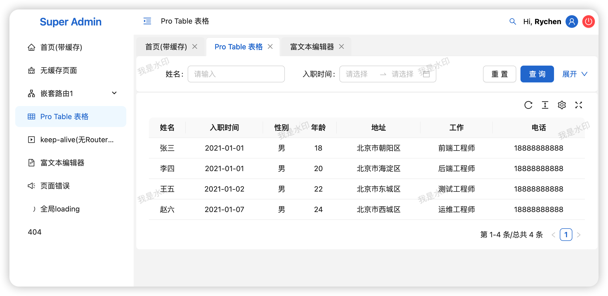

# Super Admin

[中文](./README.zh_CN.md) | English

Introduction: Backend management solution under construction 🔨...

Demo: [https://irychen.github.io/super-admin/](https://irychen.github.io/super-admin/)




## Features

-   [x] Based on React, TypeScript, Antd
-   [x] Implemented page caching mechanism based on KeepAlive component
-   [x] Multi-tab page switching
-   [x] Route-based permission control
-   [ ] Encapsulate a ProTable component (to meet customization and performance requirements) TODO
-   [ ] Dynamic theme switching + night mode TODO
-   [ ] Login page TODO

## Install dependencies

```bash
pnpm install

```

## run dev

```bash
pnpm run dev

```
