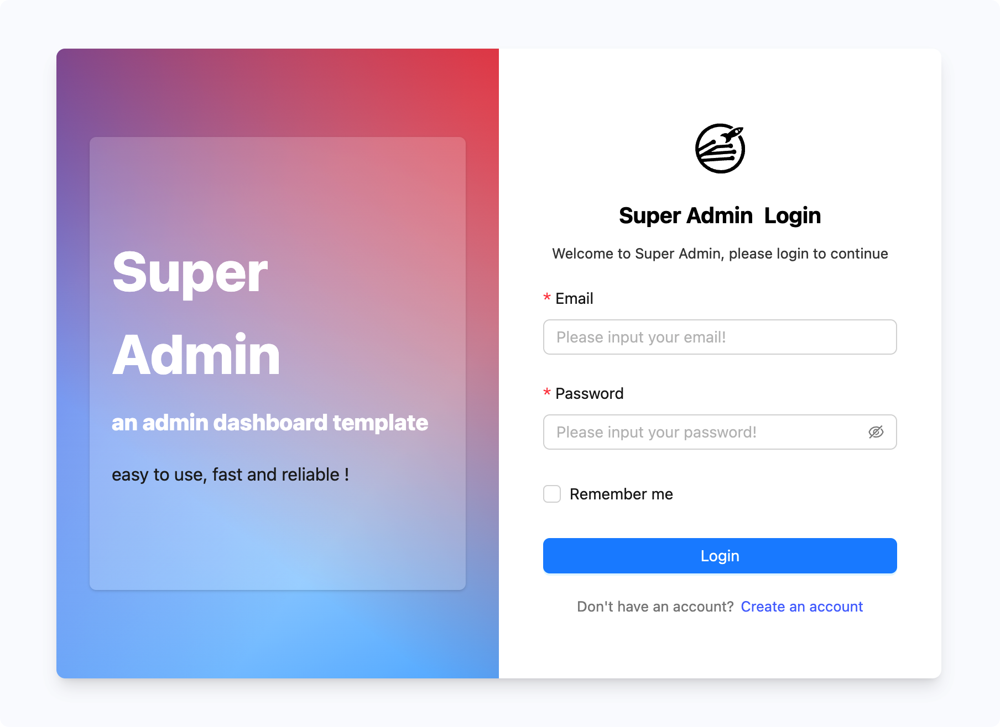
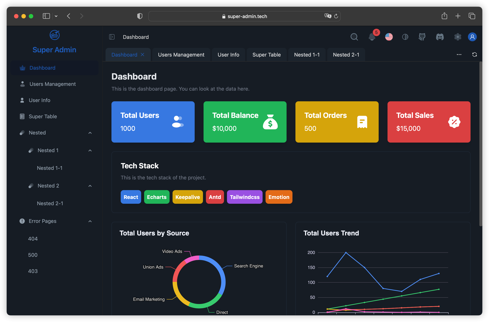

# Super Admin

中文 | [English](./README.md)

简介：正在构建中的后台管理解决方案 🔨...

演示：[https://irychen.github.io/super-admin/](https://irychen.github.io/super-admin/)




暗黑模式



## 特性

-   [x] 基于 React、TypeScript、Antd、Zustand、Axios、TailwindCSS
-   [x] 类似 Vue 中的 keepalive，多标签路由，没有大量的 DOM 元素
-   [x] 基于路由的权限控制

## 安装依赖

```bash
pnpm install
```

## 运行开发环境

```bash
pnpm run dev
```
